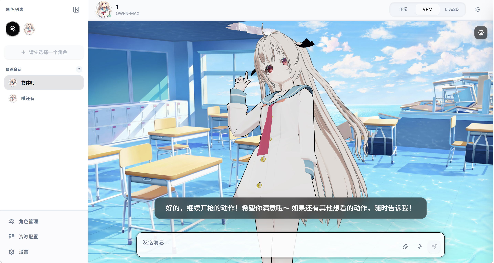

# atri-chat

[](https://www.python.org/)
[](https://fastapi.tiangolo.com/)
[](https://react.dev/)
[](LICENSE)

> 一个基于 FastAPI 和 LangChain 的多角色 AI Agent 系统，支持多模型供应商、语音识别（ASR）、语音合成（TTS）和 VRM 3D 形象交互。

## ✨ 功能特性

- 🤖 **多角色管理**：支持创建和管理多个 AI 角色，每个角色有独立的系统提示词
- 🔌 **多供应商支持**：内置支持 OpenAI、Anthropic、Google、通义千问、本地模型（Ollama）
- 🎤 **语音识别（ASR）**：支持 FunASR 和 OpenAI Whisper 两种引擎
- 🔊 **语音合成（TTS）**：支持 GPT-SoVITS 和 Genie TTS
- 👤 **VRM 3D 交互**：支持 VRM 模型加载、表情控制、动画播放和口型同步
- 💬 **流式对话**：支持流式响应，实时显示 AI 回复
- 🎨 **主题切换**：支持明暗主题切换
- 🌍 **多语言支持**：支持中英文界面切换
- 🌐 **前端界面**：基于 React 19 + TypeScript + Vite 的现代化 Web 界面


## 🚀 快速开始

### 前置要求
- Python 3.12+
- Node.js 18+
- [uv](https://github.com/astral-sh/uv) (推荐用于 Python 依赖管理)
- FFmpeg (用于音频处理)

### 1. 克隆仓库

```bash
git clone https://github.com/1sunxiaoshou/atri-chat.git
cd atri-chat
```

### 2. 后端设置

使用 `uv` 进行快速安装：

```bash
# 创建虚拟环境并安装依赖
uv sync

# 激活虚拟环境 (Windows)
.venv\Scripts\activate

# 激活虚拟环境 (Linux/macOS)
source .venv/bin/activate

# 启动后端服务
python main.py
```
后端服务默认运行在 `http://localhost:8000`。

### 3. 前端设置

```bash
cd frontend

# 安装依赖
npm install

# 启动开发服务器
npm run dev
```

### 4. 访问应用

打开前端启动后控制台的网址，开始使用 ATRI！

## 📸 界面展示

### 对话界面


### VRM 3D 模式


## ⭐ Star History

[](https://star-history.com/#1sunxiaoshou/atri-chat&Date)

## 🤝 贡献指南

欢迎提交 Pull Request 或 Issue！

1. Fork 本仓库
2. 创建特性分支 (`git checkout -b feature/AmazingFeature`)
3. 提交更改 (`git commit -m 'Add some AmazingFeature'`)
4. 推送到分支 (`git push origin feature/AmazingFeature`)
5. 提交 Pull Request

## 📄 许可证

本项目采用 [MIT License](LICENSE) 开源。

## 📧 联系方式

如有问题或建议，请通过 [GitHub Issues](https://github.com/1sunxiaoshou/atri-chat/issues) 联系。

---

⭐ 如果这个项目对你有帮助，请给个 Star 支持一下！
