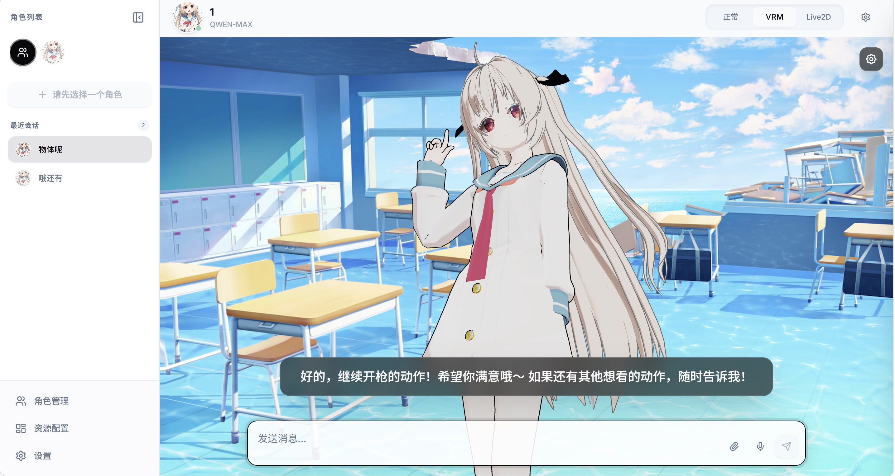
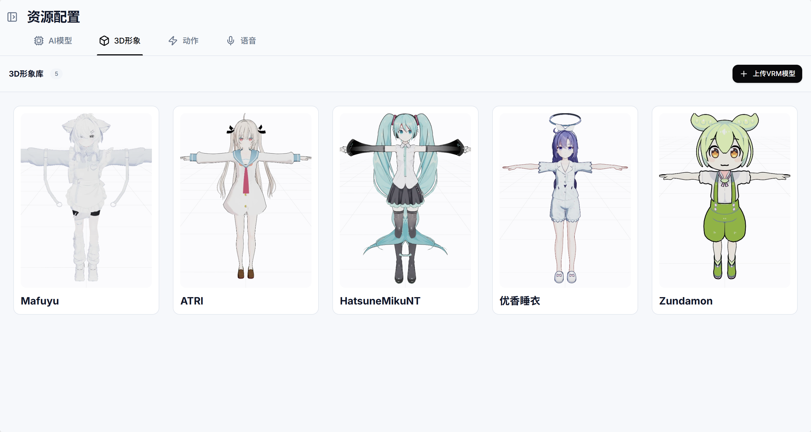

# ATRI Chat

<div align="center">


**轻量、私有、可定制的 3D AI 桌面伴侣**

[](LICENSE)
[](https://www.python.org/)
[](https://react.dev/)
[](https://tauri.app/)

[项目概览](#项目概览) | [功能特性](#功能特性) | [获取使用](#获取与使用) | [本地开发](#本地开发) | [文档中心](#文档中心)

</div>

## 项目概览

ATRI Chat 是一个开源的桌面端 3D AI 伴侣项目，整合了大语言模型、语音识别、语音合成与 VRM 3D 渲染能力，目标是提供一个本地优先、可长期使用、可持续扩展的数字伙伴。

---

## 功能特性

- **多模型驱动**：支持主流云端模型与本地 Ollama，兼顾能力和隐私。
- **角色可定制**：支持角色设定、立绘、语音和模型配置。
- **离线语音识别**：集成 SenseVoice ONNX，支持低延迟本地识别。
- **多供应商语音合成**：支持多种 TTS 服务与角色绑定。
- **长期记忆**：支持结构化的长短期记忆管理。
- **3D 互动**：基于 React Three Fiber 与 VRM 的实时渲染和动作驱动。

---

## 功能计划

我们正致力于让 ATRI Chat 变得更加聪明和有趣，以下是我们未来的开发计划：

- [x] 多 LLM 供应商接入与 LangGraph 记忆流机制
- [x] VRM 3D 模型的导入与基础动作驱动
- [x] SenseVoice 离线语音识别与多源 TTS 集成
- [ ] **obs推流**：可以将画面推送到obs
- [ ] **视觉感知能力 (Vision)**：支持屏幕捕获
- [ ] **Live2D 支持**：除了 3D，也将支持精美的 2D 动态模型
- [ ] **桌面挂件模式**：支持透明背景，让 AI 真正站在你的电脑桌面上
- [ ] **创意工坊 (Workshop)**：支持一键导入/分享社区玩家制作的角色卡、模型与动作预设
- [ ] **多平台适配**：在现有 Windows 基础之上，完善 macOS / Linux 端的打包与测试

---

## 技术栈

ATRI Chat 采用了目前最现代化的前后端分离跨端技术体系构建：

- **视窗前端**: React 19 + Tailwind CSS + Framer Motion (通过 `React Three Fiber` 驱动 3D 场景)
- **逻辑后端**: FastAPI + Python 3.12 + LangChain / LangGraph + aiosqlite
- **跨端容器**: Tauri (提供超越 Electron 的极致轻量化桌面体验与极速启动)
- **语音引擎**: SenseVoice-Small ONNX (高性能离线 ASR) + 支持多种 TTS 接口 (如 GPT-SoVITS 等)

---

## 界面预览


 
 


## 获取与使用

只需三步，即可零代码基础唤醒你的专属伴侣（*目前主要针对 Windows 用户*）：

1. 前往 [Releases](https://github.com/1sunxiaoshou/atri-chat/releases) 页面下载最新的发行版本。
2. 解压或安装后，运行目录下的 `ATRI Chat.exe`。
3. 在左下角「设置」中输入对应大模型的 API Key（或配置本地 Ollama 服务地址），即可开始交流！

---

## 本地开发

我们提供了一键式的环境依赖检查与打包构建流。

### 1. 环境前置要求
- 操作系统：Windows 10 / 11
- 环境依赖：Python 3.12+ | Node.js 18+ | Rust 1.77+
- 包管理器：推荐安装 [uv](https://github.com/astral-sh/uv) (超快速的 Python 依赖管理工具)

### 2. 快速启动开发环境
```bash
# 克隆代码库
git clone https://github.com/1sunxiaoshou/atri-chat.git
cd atri-chat

# 可选：检查发布前状态或打开发布脚本菜单
uv run python scripts/release.py check
# 或直接运行 uv run python scripts/release.py 进入交互式菜单

# 启动开发环境（自动并行启动前端 Vite 服务、后端 FastAPI 服务及 Tauri 视窗）
cd frontend
npm install
npm run tauri:dev
```

> [!TIP]
> 更完整的开发、构建和发布说明请查看：
> [开发指南](docs/01-入门/开发指南.md)
> [桌面构建与发布指南](docs/01-入门/桌面构建与发布指南.md)

---

## 文档中心

项目文档已经统一整理到 `docs/`，推荐从 [文档中心](docs/README.md) 开始：

- 入门文档：开发指南、桌面构建与发布指南、国际化脚本指南
- 架构文档：系统设计、命令系统、记忆系统架构、供应商系统、TTS 架构、日志系统
- 规划文档：路线图、未来改造参考

---

## 参与贡献

ATRI Chat 正处于快速迭代期，我们非常欢迎任何形式的开源贡献：包括但不限于提交 Bug 报告、优化前端性能、增加新的大模型支持、完善周边工具或补充文档。

1. Fork 本仓库
2. 创建您的特性分支 (`git checkout -b feat/AmazingFeature`)
3. 提交您的特性变更 (`git commit -m 'feat: Add some AmazingFeature'`)
4. 推送到您的个人仓库 (`git push origin feat/AmazingFeature`)
5. 新建并提交 Pull Request

---

## Star History

[](https://www.star-history.com/?repos=1sunxiaoshou%2Fatri-chat&type=date&legend=top-left)

---

## 许可证

本项目基于 [MIT License](LICENSE) 协议开源。请自由使用，并在您的相关项目中遵循此协议开源共享。

---

<p align="center"><i>"毕竟我可是高性能的嘛！"<n></n> —— ATRI -My Dear Moments-</i></p>
