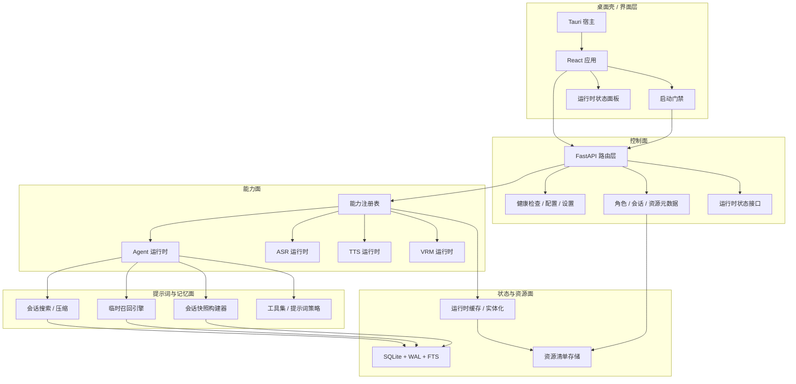
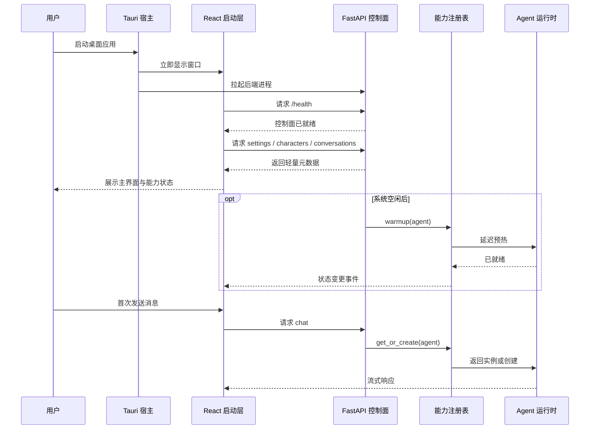
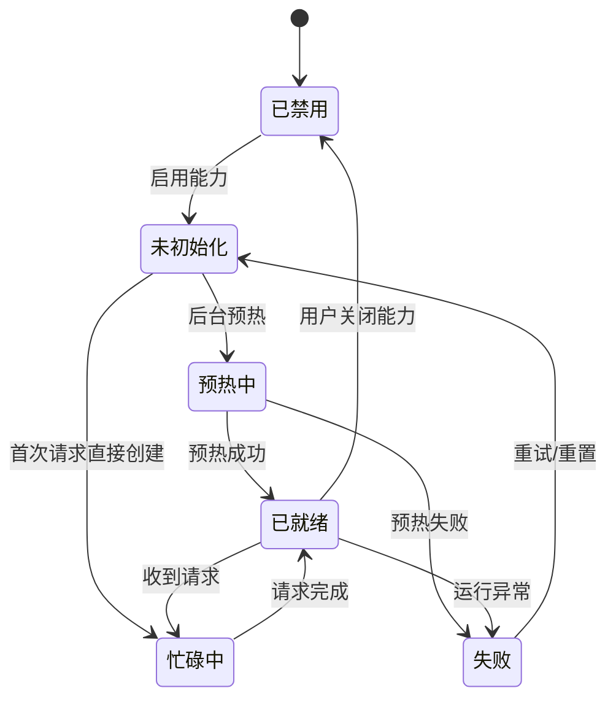
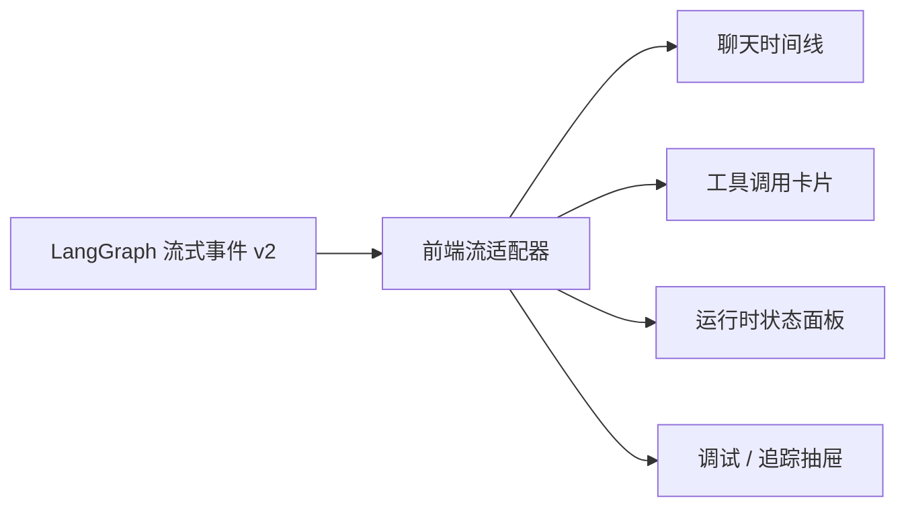
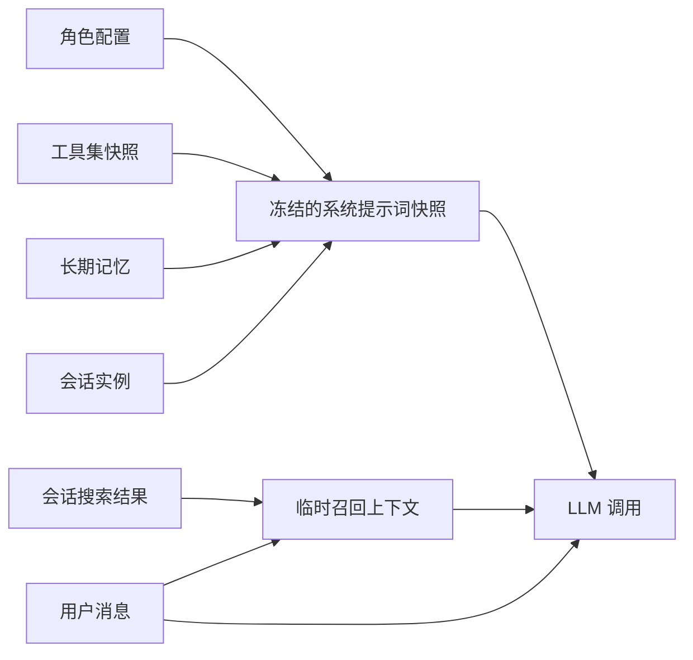
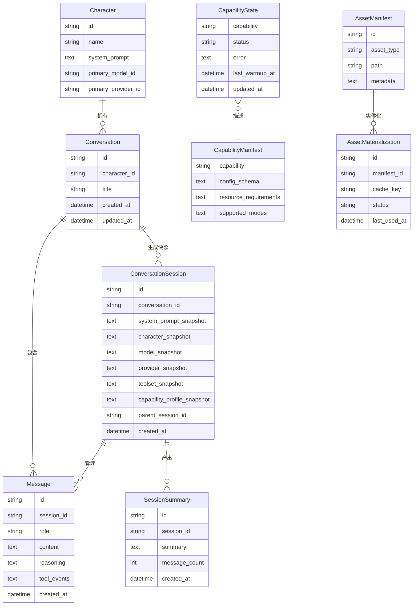
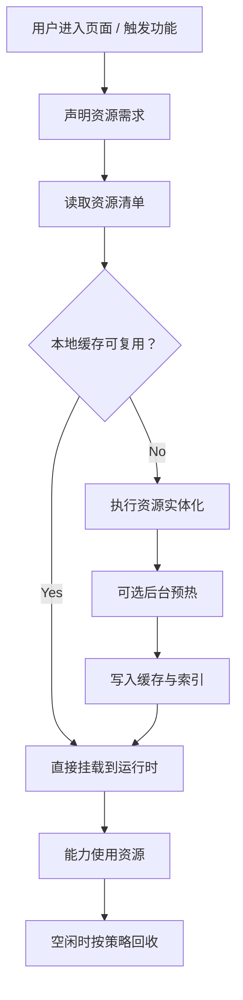

# 系统性能与运行时升级方案

本文档是 ATRI Chat 在 2026 年的系统级演进蓝图，覆盖启动性能、运行时分层、提示词与记忆模型、资源按需加载、状态可观测性以及分阶段实施计划。

目标不是把 ATRI Chat 改造成一个通用自治代理平台，而是把它升级为一个对桌面伴侣场景更友好的系统：

- 首屏秒开
- 能力按需初始化
- 会话状态稳定可恢复
- 本地模型和重资源场景下依然保持响应速度

---

## 1. 结论先行

最终方向确定为：

> **桌面伴侣壳 + 轻量控制面 + 可选能力面 + 稳定提示词面 + 可观测状态面**

这意味着系统将从当前偏“单体冷启动 + 单协调器中心”的形态，演进为五层分工明确的运行时结构：

1. `Shell/UI Layer`
2. `Control Plane`
3. `Capability Plane`
4. `Prompt & Memory Plane`
5. `State & Asset Plane`

### 1.1 为什么不是直接照搬 Hermes Agent

Hermes Agent 值得借鉴的点：

- 平台无关核心
- 工具、记忆、上下文、插件的分层设计
- 系统提示词稳定优先
- 会话、状态、执行过程可观测

Hermes Agent 不适合 ATRI 直接照搬的点：

- import-time 工具自注册，不利于桌面端冷启动
- 默认工具面过宽，会显著拖慢本地模型
- 单个大 Agent Loop 容易成为演进瓶颈

因此，ATRI 的最终方向不是“更通用的 Agent”，而是“更轻、更稳、更可分级启停的桌面多模态运行时”。

---

## 2. 设计目标与非目标

### 2.1 目标

- 将“窗口可见”与“后端全部能力 ready”彻底解耦
- 将控制面接口与 Agent/ASR/TTS/VRM 等重能力解耦
- 让系统提示词在单次会话内保持稳定，减少缓存破坏
- 为本地模型缩小默认工具面，减少 prompt 负担
- 将 VRM、动作、TTS、ASR 模型等资源改成 manifest-first + lazy-load
- 建立统一的能力状态模型，让前端知道系统正在做什么
- 让会话具备快照、恢复、搜索、压缩和诊断能力

### 2.2 非目标

- 不把 ATRI 改造成 Telegram/Discord/Slack 多平台消息网关
- 不在当前阶段引入完整插件市场或外部 Memory Provider 生态
- 不把所有能力拆成独立微服务
- 不为“理论最优”牺牲桌面端开发效率
- 当前阶段不落地子代理编排，只保留未来扩展边界

---

## 3. 对标 Hermes Agent 的结论

### 3.1 借鉴与取舍

| 维度 | Hermes 的经验 | ATRI 采纳方式 | ATRI 不采纳部分 |
|---|---|---|---|
| 核心与入口边界 | 一个平台无关核心服务多个入口 | 保留统一核心，但入口仅服务桌面端与本地 API | 不做多平台消息网关优先 |
| 工具系统 | toolset 分组、按平台启用 | 建立 `chat-basic` / `chat-vrm` 等 Agent toolset，并把 ASR/TTS 设计为能力适配器 | 不采用 import-time 全量注册 |
| 提示词策略 | 系统提示词稳定，避免中途重建 | 会话开始时冻结系统提示词快照 | 不再每轮动态重建 system prompt |
| 记忆系统 | 持久记忆、会话搜索、压缩 | 拆分长期记忆、会话快照、检索记忆 | 当前阶段不引入复杂外部 provider |
| 状态持久化 | SQLite + FTS + 会话 lineage | 引入会话快照、FTS、运行时状态表 | 不复制其整套 session JSON 双写模型 |
| 可观测性 | 工具调用、进度、会话状态可见 | 建立 runtime state API 和前端状态面板 | 不做 CLI/TUI 优先 |
| 子代理与委托 | 可并行 delegate | 仅保留未来扩展点 | 当前不引入多代理编排复杂度 |

### 3.2 架构启示

- 对 ATRI 最有价值的不是“更多工具”，而是“更小的默认能力面”
- 对本地模型最关键的不是“更强的 Agent loop”，而是“更稳的 prompt 和更窄的 tool schema”
- 对桌面应用体感最关键的不是 `/health` 更快，而是“窗口先可见、状态可解释、资源逐步可用”
- 对工程落地最关键的不是自造一套智能体协议，而是尽量贴合 LangChain / LangGraph 官方运行时与 streaming 模型

---

## 4. 实现约束：以 LangChain / LangGraph 官方模型为准

这一节是后续编码时的硬约束。凡是与 LangChain / LangGraph 官方运行时模型冲突的内部抽象，优先调整 ATRI 设计，而不是硬包一层私有协议。

### 4.1 Agent 核心保持 `create_agent` + LangGraph Runtime

- 后端智能体主入口继续基于 `langchain.create_agent`
- 中间件、流式事件、短期状态、工具调用都优先使用官方抽象
- 自定义逻辑尽量落在 middleware、runtime context、tool runtime、custom stream 上

### 4.2 运行时上下文优先使用官方 `context` / `Runtime`

- 角色、会话、用户、模式、运行时依赖优先通过 `context` 传入
- 长期记忆与跨会话共享状态优先通过 `store` 管理
- 不再依赖隐式全局单例传递请求级上下文

### 4.3 会话指针优先使用官方 `thread_id`

- 会话恢复、断点续跑、人工介入、时间旅行、历史回放，都以 `thread_id` 为运行时主指针
- ATRI 在当前阶段采用 **`conversation_id == thread_id`** 的策略，即业务主键与运行时线程主键保持一对一且直接复用
- 这样可以减少映射层、降低恢复复杂度，并让前端、数据库和 LangGraph 运行时围绕同一个会话标识协同

### 4.4 前后端事件模型优先使用官方 streaming v2

- 后端流式输出默认采用 LangGraph `version="v2"` 语义
- 前端状态消费优先兼容 `messages / updates / custom / metadata / interrupts`
- 避免继续发展一套与官方事件模型平行的私有 SSE 协议

### 4.5 子代理能力先预留，不提前落地

- 当前阶段不引入 multi-agent / deep agents 编排
- 但事件模型和状态面要保留 `ns` / `subgraph` 来源字段
- 工具调用卡片、运行状态列表、时间线面板都应兼容未来子图事件

### 4.6 LangChain 官方能力到 ATRI 模块的落地映射

这一小节回答“LangChain 能做什么”以及“在 ATRI 里具体落到哪里”。

| LangChain / LangGraph 能力 | 在 ATRI 中的职责 | 推荐落地位置 |
|---|---|---|
| `create_agent` | 智能体主入口与标准 Agent loop | `core/agent_coordinator.py` + 后续 `core/capabilities/agent/` |
| `middleware` | 动态模型、工具过滤、提示词注入、审计、重试、guardrails | `core/middleware/` |
| `context_schema` / `Runtime.context` | 角色、会话、模式、数据库依赖等请求级上下文 | `core/middleware/dynamic_prompt.py`、`core/dependencies.py` |
| `ToolRuntime` / `Runtime.store` | 长期记忆、用户偏好、跨会话事实 | 后续 `core/state/` 与 `core/chat/recall.py` |
| `checkpointer` + `thread_id` | 短期记忆、执行恢复、时间旅行、interrupt 恢复 | `core/dependencies.py`、后续 `conversation_sessions` |
| `streaming v2` | 消息、步骤、进度、interrupt 的统一事件总线 | `api/routes/messages.py`、后续 `core/chat/stream_events.py` |
| `get_stream_writer()` / custom stream | 工具进度、Agent 阶段、运行状态回前端 | 后续 `agent_run_events` 与前端状态面板 |
| `useStream` | 前端统一消费 messages / updates / custom / interrupts | 后续前端聊天层与运行时状态层 |
| `PIIMiddleware` / `HumanInTheLoopMiddleware` | 合规脱敏与高风险审批 | 后续 `core/middleware/safety.py` |
| MCP adapters / interceptors | 未来外部工具、插件、远程能力注册表 | 当前仅预留，不落地 |

#### 4.6.1 智能体入口怎么写

- 保持 `create_agent(...)` 为唯一智能体构建入口。
- `AgentCoordinator` 不再是“智能体框架本身”，而是“ATRI 业务协调器”。
- 它负责：
  - 拼装模型、工具、中间件、checkpointer、store
  - 直接使用 `conversation_id` 作为 `thread_id`
  - 把 LangChain 事件翻译为 ATRI 前端可消费的状态流

建议演进为：

```text
core/capabilities/agent/
├── factory.py           # create_agent 装配
├── context.py           # Runtime context schema
├── toolsets.py          # 工具集定义
├── middleware.py        # 中间件装配入口
└── coordinator.py       # ATRI 业务协调器
```

#### 4.6.2 Prompt 与上下文怎么写

- `system_prompt` 不再每轮重建，而是在“会话创建”时生成快照。
- 每轮动态变化的信息走 `before_model` 或 `dynamic_prompt`，但只追加轻量 recall/context。
- 角色、模式、VRM 开关、用户偏好等请求级静态信息通过 `context` 传入。

推荐拆分：

```text
core/chat/
├── session_snapshot.py  # 生成 system_prompt_snapshot
├── prompt_policy.py     # 规则：哪些信息进快照，哪些是临时注入
├── recall.py            # 每轮 recall / RAG / memory 召回
└── compression.py       # 长会话压缩
```

当前过渡实现可先在 `core/prompts/` 中完成“角色 + 模式”的稳定提示词装配，再在阶段 5 收口到 `core/chat/`：

```text
core/prompts/
├── role_prompt.py       # 角色系统提示词
├── mode_prompt.py       # 模式提示词（可读取动作 / 表情等数据库资源）
├── service.py           # 稳定 system prompt 组装入口
└── template_loader.py   # 模板加载
```

#### 4.6.3 工具系统怎么写

- 当前 ATRI 的工具大多是“静态存在，动态启用”，最适合官方推荐的“静态注册 + middleware 过滤”模式。
- 不需要现在做运行时工具发现。
- 只有未来接 MCP、远程注册表、插件市场时，才进入 `wrap_model_call + wrap_tool_call` 的动态工具路径。
- 但要注意：`ASR` 和 `TTS` 这类能力本体不等于 Agent tool，它们应属于 `Capability`，只是在需要时暴露一个 Agent 可调用的工具适配器。

推荐实现：

- `chat-basic`
  - 长期记忆、基础检索、轻量资料读取
- `chat-vrm`
  - 表情、动作、镜头、注视相关工具
- `memory-basic`
  - 长期记忆写入/检索工具
- `admin-assets`
  - 只在后台管理模式开放

能力与工具的边界应明确为：

- `Capability`
  - `agent`
  - `asr`
  - `tts`
  - `vrm`
- `Capability Adapter`
  - `ASR UI API`
  - `ASR Agent Tool`
  - `TTS UI API`
  - `TTS Agent Tool`
  - `VRM UI Controller`
  - `VRM Agent Tool`
- `Toolset`
  - 只包含 Agent 在推理环里可见、可调用的工具白名单

这意味着：

- ASR/TTS 可以同时被 UI 和 AI 使用
- 但它们的运行时、缓存、状态、预热只有一份
- Agent 是否能调用 ASR/TTS，要由 toolset 决定，而不是由能力是否存在来决定

对应代码建议：

```text
core/tools/
├── toolsets/
│   ├── chat_basic.py
│   ├── chat_vrm.py
│   ├── memory_basic.py
│   └── admin_assets.py
└── registry.py

core/capabilities/
├── asr/
│   ├── runtime.py
│   ├── service.py
│   ├── ui_api.py
│   └── tool_adapter.py
├── tts/
│   ├── runtime.py
│   ├── service.py
│   ├── ui_api.py
│   └── tool_adapter.py
└── vrm/
    ├── runtime.py
    ├── service.py
    ├── ui_api.py
    └── tool_adapter.py
```

#### 4.6.4 短期记忆怎么写

- 线程级短期记忆完全交给 `checkpointer + thread_id`。
- ATRI 的 `conversation_id` 直接就是运行时 `thread_id`。
- 每次聊天调用、interrupt 恢复、未来时间旅行，都必须显式带上同一个会话 ID。

推荐新增：

```text
conversation_sessions
├── id
├── conversation_id
├── system_prompt_snapshot
├── toolset_snapshot
├── capability_profile_snapshot
├── model_snapshot
├── provider_snapshot
└── created_at
```

#### 4.6.5 长期记忆怎么写

- 长期记忆不塞进 `messages` 表。
- 使用 `store` 维护跨线程共享的 JSON 文档。
- SQLite 业务表只负责 UI 管理、搜索、审计和索引。

推荐命名空间：

- `("users", user_id)`
- `("characters", character_id)`
- `("conversations", conversation_id, "facts")`
- `("global", "runtime_preferences")`

#### 4.6.6 可观测性怎么写

- 所有 Agent 运行状态都要来自官方 streaming v2 事件流。
- `messages` 负责 token 和 tool call chunk。
- `updates` 负责 graph step 状态。
- `custom` 负责我们自定义的进度、阶段、运行状态。
- `interrupts` 负责等待用户输入或审批。

推荐后端职责拆分：

```text
core/chat/stream_events.py
├── emit_progress()
├── emit_step()
├── emit_tool_status()
├── emit_interrupt()
└── normalize_stream_part()

core/state/agent_run_event_service.py
├── persist_event()
├── list_events_by_thread()
└── summarize_latest_status()
```

#### 4.6.7 前端怎么消费

- 前端最终要逐步对齐 `useStream` 的思路，即：
  - 聊天时间线消费 `messages`
  - 工具卡片消费 tool call 状态
  - 状态面板消费 `updates + custom`
  - 审批与暂停恢复消费 `interrupts`
- 当前实施默认使用官方 `@langchain/react` 的 `useStream`
- 即便短期内存在兼容层，内部事件模型也要保持与官方 `useStream` / LangGraph v2 streaming 格式兼容

推荐前端模块演进：

```text
frontend/
├── hooks/
│   ├── useAgentStream.ts
│   └── useRuntimeStatus.ts
├── components/chat/
│   ├── ChatTimeline.tsx
│   ├── ToolCallCard.tsx
│   ├── ReasoningPanel.tsx
│   └── InterruptPanel.tsx
└── components/runtime/
    └── RuntimeStatusPanel.tsx
```

#### 4.6.8 Guardrails 怎么写

- 安全控制不要零散写在业务逻辑里。
- 优先用 middleware 集中管理：
  - 输入前：PII、鉴权、限流、非法请求阻断
  - 工具前：高风险操作审批
  - 输出后：敏感信息脱敏、结构校验

建议新增：

```text
core/middleware/safety.py
├── pii_redaction_middleware
├── approval_middleware
└── output_validation_middleware
```

#### 4.6.9 多平台和未来 MCP 怎么预留

- 当前智能体核心不依赖 Tauri 类型或桌面窗口对象。
- 入口层只负责 transport 和 session 绑定。
- 未来如果接 Web、移动端、第三方服务或 MCP 工具，优先在 adapter 层扩展，不改 Agent Runtime 主体。

这意味着：

- `main.py` / FastAPI 负责本地 API 入口
- `frontend/src-tauri/` 负责桌面宿主
- 后续如果做 Web，新增 Web 入口，不改智能体核心
- 如果接 MCP，优先通过 interceptor 使用 `ToolRuntime`，而不是自己另造工具协议

---

## 5. 当前系统的关键问题

### 5.1 启动路径仍然偏重

- 后端仍在应用启动时全量注册路由
- 控制面与能力面的边界尚未彻底拉开
- 后台预热已经后移，但能力生命周期还没有统一抽象

### 5.2 工具面仍然偏宽

- 当前动态工具过滤并没有真正缩小工具集合
- 本地模型会为过宽的工具定义付出额外 token 和推理成本

### 5.3 提示词仍然是“每轮动态生成”

- 角色提示词当前仍在请求级动态构造
- 这会破坏 prefix cache，也不利于会话复现和诊断

### 5.4 会话模型偏薄

- `Conversation` 和 `Message` 只覆盖了最基础的聊天持久化
- 尚未建模 `system_prompt_snapshot`、`toolset_snapshot`、`runtime_state`、`session_summary`

### 5.5 资源加载还没有形成统一策略

- VRM/动作/音色/ASR 模型在不同地方各自处理
- manifest 元数据、预热、缓存、重试、释放策略还没有统一入口

---

## 6. 目标架构总览

### 6.1 五层架构图



### 6.2 层职责

#### `Shell / UI Layer`

- 负责窗口创建、首屏渲染、启动状态展示、用户交互
- 不等待全部能力 ready 才展示 UI
- 所有“系统正在做什么”的状态都必须可视化

#### `Control Plane`

- 只暴露轻量元数据接口和状态接口
- 不直接持有 Agent/ASR/TTS/VRM 的真实运行时实例
- 只通过 `CapabilityRegistry` 查询状态和请求能力

#### `Capability Plane`

- 统一管理所有重能力的生命周期
- 统一能力状态：`disabled / uninitialized / warming / ready / busy / failed`
- 支持 `get_or_create`、`warmup`、`shutdown`、`manifest`

#### `Prompt & Memory Plane`

- 会话开始时冻结系统提示词快照
- 每轮仅追加临时召回上下文，不中途改写系统提示词
- 会话搜索、压缩、总结、长期记忆都在这一层

#### `State & Asset Plane`

- 持久化会话、快照、FTS、状态、资源元数据
- 资源加载先查 manifest，再做 materialization
- 为 VRM/动作/TTS/ASR 建立统一缓存与回收策略

---

## 7. 启动与就绪模型

### 7.1 启动时序图



### 7.2 三阶段就绪定义

1. `Shell Ready`
   Tauri 窗口已出现，前端骨架屏可交互。

2. `Control Plane Ready`
   `/health`、`/settings`、`/characters`、`/conversations`、资源元数据接口可用。

3. `Capability Ready`
   Agent/ASR/TTS/VRM 中的某个能力进入 `ready` 状态，可随时处理请求。

### 7.3 启动原则

- 不能为了让 `/health` 更快而牺牲系统清晰度
- 不能为了预热所有能力而阻塞 UI
- 预热是优化项，不是首屏前提

---

## 8. 能力注册表与生命周期

### 8.1 生命周期状态图



### 8.2 Registry 统一接口

建议新增统一抽象：

```text
CapabilityRegistry
├── list_capabilities()
├── get_status(capability)
├── get_manifest(capability)
├── get_or_create(capability)
├── warmup(capability)
├── shutdown(capability)
└── reset(capability)
```

### 8.3 第一批纳入 Registry 的能力

- `agent`
- `asr`
- `tts`
- `vrm`

### 8.4 第二批纳入 Registry 的能力

- `checkpointer`
- `session-search`
- `asset-materializer`
- `prompt-recall`

---

## 9. Toolset 与本地模型性能策略

### 9.1 最终 Toolset 划分

| Toolset | 用途 | 默认启用位置 |
|---|---|---|
| `chat-basic` | 普通文本聊天 | 聊天页 |
| `chat-vrm` | 与 VRM 表演相关的动作/情绪工具 | VRM 聊天页 |
| `memory-basic` | 长期记忆与会话检索 | 聊天页，按需启用 |
| `admin-assets` | 资源管理后台 | 管理页 |
| `developer-mode` | 调试与诊断能力 | 开发模式 |

### 9.2 设计规则

- 每个会话只暴露当前模式真正需要的工具
- 本地模型优先使用最窄 toolset
- `toolset_snapshot` 作为会话快照的一部分持久化
- VRM 工具不能泄漏到纯文本模式
- ASR/TTS 不属于 toolset 本体，只能通过适配器决定是否对 Agent 暴露

### 9.3 能力档案与适配器

除 `toolset` 外，还要引入 `capability profile`，用来描述当前会话或页面启用了哪些系统级能力。

| Capability Profile 字段 | 含义 |
|---|---|
| `asr_enabled` | 当前是否允许使用 ASR 能力 |
| `tts_enabled` | 当前是否允许使用 TTS 能力 |
| `vrm_enabled` | 当前是否允许使用 VRM 能力 |
| `agent_enabled` | 当前是否允许使用 Agent 能力 |

能力档案决定“系统能不能用这项能力”，适配器决定“UI 能不能调”“Agent 能不能调”。

这里的最终边界定为：

- `capability profile`
  - 面向系统
  - 决定能力本体是否启用，以及哪些调用面可用
  - 例如：`tts` 已启用，但仅允许 `ui_api`，不允许 `agent_tool`
- `toolset`
  - 面向模型
  - 决定当前这轮 Agent 推理真正能看到哪些工具
  - 它是由 `capability profile + 当前模式 + 当前页面/角色策略` 编译出来的结果

推荐结构：

```json
{
  "agent": { "enabled": true },
  "asr": { "enabled": true, "ui_api": true, "agent_tool": false },
  "tts": { "enabled": true, "ui_api": true, "agent_tool": true },
  "vrm": { "enabled": true, "ui_api": true, "agent_tool": true }
}
```

而与之对应的 `toolset` 只保留真正注入给模型的工具，例如：

```json
["memory.search", "memory.write", "vrm.perform_actions"]
```

### 9.4 当前阶段的关键修正

- 先修正现有动态工具过滤逻辑，确保过滤真正生效
- 再将工具注册改为 “声明存在 + 会话级选取”

### 9.5 通用扩展能力架构

后续 ATRI 很可能继续引入 OCR、视觉理解、文件解析、网页浏览、搜索、翻译、视频分析、知识库索引等能力。为了避免每新增一项能力就复制一套新的接入方式，系统应统一采用以下扩展模型：

> **能力本体统一，调用面分离，策略独立，状态可观测。**

#### 9.5.1 四层扩展模型

1. `Capability Kernel`
   每个能力先实现统一的能力本体，负责真正执行、生命周期、配置和状态。

2. `Adapter Layer`
   同一能力通过不同适配器暴露给 UI、Agent、后台任务、管理接口或未来的 MCP 接入。

3. `Policy Layer`
   用 `capability profile` 和 `toolset` 决定“系统能不能用”和“Agent 能不能调”。

4. `Event Layer`
   所有能力都走统一的状态与进度事件模型，供前端状态面板和调试系统复用。

#### 9.5.2 通用能力模型

每个能力目录应至少具备：

```text
capabilities/<name>/
├── runtime.py
├── service.py
├── manifest.py
├── status.py
└── adapters/
    ├── ui_api.py
    ├── agent_tool.py
    ├── background_job.py
    └── admin_api.py
```

其中：

- `runtime.py`
  - 负责模型、客户端、资源句柄、缓存等真实运行时
- `service.py`
  - 负责能力的统一业务接口
- `manifest.py`
  - 描述能力所需资源、支持模式、配置项
- `status.py`
  - 定义能力状态、错误信息、最近预热信息
- `adapters/`
  - 面向不同调用面暴露适配接口

#### 9.5.3 统一生命周期接口

任意新能力都应纳入 `CapabilityRegistry`，至少实现：

```text
Capability
├── manifest()
├── status()
├── get_or_create()
├── warmup()
├── shutdown()
└── reset()
```

这样后续不管新增的是 OCR 还是浏览器工具，前端和控制面都能用同一套方式查询与管理。

#### 9.5.4 统一事件模型

任意新能力都应产生统一的能力事件，而不是各自打印私有日志：

```text
CapabilityEvent
├── capability
├── adapter
├── thread_id
├── run_id
├── phase
├── status
├── payload
└── timestamp
```

这样前端可以统一显示：

- 哪个能力正在运行
- 通过哪个调用面运行
- 卡在哪一步
- 是否可恢复
- 是否失败以及为什么失败

#### 9.5.5 新能力接入的判断原则

每新增一项能力时，只需要回答 4 个问题：

1. 它是不是一个独立能力本体？
   如果是，就进入 `core/capabilities/<name>/`

2. 谁会调用它？
   UI、Agent、后台任务、管理员、未来 MCP

3. 它是否需要生命周期管理？
   如果需要，就纳入 `CapabilityRegistry`

4. 它是否会影响会话行为？
   如果会，就写入 `capability_profile_snapshot` 或 `toolset_snapshot`

#### 9.5.6 对未来能力的示例

| 新能力 | 能力本体 | UI 适配器 | Agent 适配器 | 是否纳入 toolset |
|---|---|---|---|---|
| OCR | `ocr` | 图片识别页面 | `extract_text_from_image` | 是 |
| 视觉理解 | `vision` | 图片分析页 | `analyze_image` | 是 |
| 网页浏览 | `browser` | 可选调试页 | `browse_web` | 是 |
| 文件解析 | `document_parser` | 上传预览页 | `parse_document` | 是 |
| 翻译 | `translation` | UI 直接翻译 | `translate_text` | 可选 |
| 视频分析 | `video_analysis` | 媒体页 | `analyze_video` | 是 |
| 语音输出 | `tts` | 直接播放 | `synthesize_speech` | 可选 |
| 语音识别 | `asr` | 录音转写 | `transcribe_audio` | 可选 |

#### 9.5.7 设计原则

- 新能力先做成能力本体，再考虑谁来调用它
- Adapter 可以增加，但能力本体尽量只有一份
- 能力状态与工具暴露策略必须解耦
- 前端永远只消费统一状态流，不消费私有实现细节

---

## 10. Agent 可观测性与前端状态回传

### 10.1 设计目标

- 前端不仅知道“有没有回复”，还要知道“Agent 正在做哪一步”
- 工具调用、模型阶段、等待人工、重试、错误、恢复，都要进入统一状态流
- 运行状态必须能被 UI、日志、调试页、后续时间旅行功能复用

### 10.2 官方能力映射

根据 LangGraph / LangChain 官方文档，ATRI 后续的运行状态回传优先建立在以下事件模型上：

- `messages`
  - LLM 输出 token、工具调用 chunk、最终消息
- `updates`
  - 每个 graph step 的状态更新
- `custom`
  - 由节点或工具主动发出的进度、阶段、状态消息
- `interrupts`
  - 人工介入或外部输入等待点
- `metadata`
  - run / thread / 历史信息

对于 VRM 模式，最终链路明确为：

- AI 通过 `perform_actions` 输出轻量命令列表 `commands: string[]`
- 第一版只允许：
  - `say <emotion> | <text>`
  - `emotion <name>`
  - `motion <name>`
  - `wait <ms>`
- 镜头控制不混入该工具，而是走独立工具 `control_camera`
- 中间件或后处理负责：
  - 注入当前场景状态
  - 为 `say` 触发 TTS
  - 发出 `custom events`
- 前端消费 `messages / tool calls / custom events / interrupts`
- `StreamAdapter` 将命令列表解析为前端内部执行对象
- `VRMDirector / Store / R3F` 负责真正执行 VRM 控制

也就是说，VRM 不由后端直接操作渲染对象，而是由前端执行层落地。

### 10.3 前端消费模型



### 10.4 建议的运行时事件结构

前端内部不直接依赖某个 provider 的原始事件，而是统一收敛为：

```text
AgentRunEvent
├── type: token | step | tool | progress | interrupt | error | finish
├── thread_id
├── run_id
├── namespace
├── capability
├── status
├── message
├── payload
└── timestamp
```

### 10.5 必须回传到前端的状态

| 类别 | 必要字段 |
|---|---|
| 会话维度 | `thread_id` `run_id` `conversation_id` |
| Agent 阶段 | `current_step` `status` `attempt` |
| 工具调用 | `tool_name` `tool_status` `input_preview` `error` |
| 模型输出 | `token_streaming` `reasoning_visible` `final_output_ready` |
| 中断点 | `interrupt_id` `interrupt_kind` `awaiting_user` |
| 系统健康 | `agent_ready` `asr_ready` `tts_ready` `vrm_ready` |
| VRM 驱动 | `vrm_command_type` `segment_id` `scene_state_version` `tts_status` |

### 10.6 设计原则

- 所有运行状态都必须有时间戳
- 所有运行状态都必须能映射回 `thread_id`
- 状态流和消息流要解耦，但可以共用同一个 stream 通道
- 前端不能只靠字符串日志推测状态

---

## 11. Prompt、记忆与会话快照

### 11.1 提示词策略图



### 11.2 最终原则

- `system prompt` 在会话开始时冻结
- 每轮不重建 `system prompt`
- 临时召回内容放在本轮上下文中，不改写快照
- 角色、模型、供应商、toolset 都要进入会话快照

### 11.3 记忆拆层

#### 长期记忆

- 角色稳定设定
- 用户偏好
- 环境事实

#### 会话快照

- `system_prompt_snapshot`
- `model_snapshot`
- `provider_snapshot`
- `character_snapshot`
- `toolset_snapshot`
- `capability_profile_snapshot`

#### 检索记忆

- 历史会话搜索
- 对话总结
- 主题摘要

### 11.4 压缩策略

- 保护开头几轮和最近几轮
- 中间部分压缩为摘要
- 工具结果先做廉价截断，再做摘要
- 压缩后保留 lineage，避免“失忆式续聊”

---

## 12. 数据与状态模型

### 12.1 目标数据模型图



### 12.2 新增持久化对象

- `conversation_sessions`
- `session_summaries`
- `capability_states`
- `agent_run_events`
- `asset_manifests`
- `asset_materializations`

### 12.3 保留现有对象

- `characters`
- `conversations`
- `messages`
- 现有 provider/model/voice/asset 相关表

---

## 13. 资源按需加载策略

### 13.1 资源加载图



### 13.2 具体策略

#### VRM

- 聊天页只加载角色卡片所需元数据和缩略图
- 进入 VRM 模式才开始加载模型本体
- 常用动作使用 LRU 缓存

#### TTS

- 设置页只拉 provider/voice 元数据
- 真正合成时再初始化 provider client
- UI 直接播放链路通过 `TTS UI API` 调用统一服务
- 如果未来 Agent 需要主动合成或处理附件语音，则通过 `TTS Agent Tool` 访问同一能力服务

#### ASR

- 仅在用户首次录音时初始化识别器
- ASR 管理页显示 manifest 和安装状态，不触发引擎本体加载
- 前端录音输入通过 `ASR UI API` 直接取文本
- 如果未来 Agent 需要转写音频附件，则通过 `ASR Agent Tool` 访问同一能力服务

#### Prompt/Memory

- 会话摘要、检索索引后台构建
- 非当前会话的详细内容按搜索命中时再加载

---

## 14. 多平台预留与推荐目录演进

### 14.1 多平台预留原则

- 先不做多平台入口，但从现在开始避免把桌面端假设写进智能体核心
- `Shell Adapter` 与 `Transport Adapter` 分层
- 未来新增 Web、移动端、第三方接入时，只替换入口层，不重写 Agent Runtime

### 14.2 推荐入口适配层

```text
entrypoints/
├── tauri_desktop/
├── web_app/
├── local_api/
└── future_integrations/
```

### 14.3 推荐目录演进

```text
main.py
api/
  routes/
    health.py
    runtime.py
    conversations.py
    characters.py
    assets.py
    chat.py
    asr.py
    tts.py
core/
  bootstrap.py
  app_factory.py
  runtime/
    registry.py
    events.py
    status.py
  capabilities/
    agent/
    asr/
    tts/
    vrm/
  chat/
    session_snapshot.py
    prompt_policy.py
    compression.py
    recall.py
    stream_events.py
  state/
    runtime_state_service.py
    session_search_service.py
    agent_run_event_service.py
  assets/
    manifest_service.py
    materializer.py
```

### 14.4 演进原则

- 先分离运行时职责，再做目录搬迁
- 先抽 `registry`，再拆 `agent_coordinator`
- 目录结构服务于边界，而不是反过来

---

## 15. 实施计划

### 15.1 阶段 0：收敛冷启动与工具面

**目标：** 让现有架构在不大改行为的前提下，先把启动与本地模型性能风险压下来。

**任务：**

- 修正动态工具过滤逻辑
- 将当前工具按模式划分为显式 toolset
- 为聊天模式默认使用最窄工具集
- 清理所有仍会触发重依赖的 metadata 路径
- 统一当前流式事件的最小状态结构，为后续前端状态面板做准备

**验收：**

- 文本聊天与 VRM 聊天的工具面可区分
- 本地模型首轮响应时间明显下降
- `import main` 与 `/health` 基线稳定

### 15.2 阶段 1：引入 Capability Registry

**目标：** 让 Agent/ASR/TTS/VRM 不再通过分散单例管理。

**任务：**

- 新增 `CapabilityRegistry`
- 将 `get_agent_coordinator()`、ASR、TTS 工厂接入 registry
- 新增 `/runtime/status` 接口
- 前端新增能力状态展示
- 建立 `agent_run_events` 的采集与转发服务

**验收：**

- 任一能力都可查询状态
- 控制面不再隐式创建重能力
- 后端启动时不要求能力实例必须存在

### 15.3 阶段 2：会话快照与提示词稳定化

**目标：** 让会话具备稳定 system prompt 和可恢复性。

**任务：**

- 新增 `conversation_sessions`
- 在会话开始时生成 `system_prompt_snapshot`
- 将检索上下文改为临时注入而不是改写 system prompt
- 增加 `toolset_snapshot`
- 将运行时上下文与 `thread_id` / `conversation_id` 映射固化

**验收：**

- 单次会话中 system prompt 不再变化
- 会话可回放、可诊断
- 相同输入在相同快照下具备更高复现性

### 15.4 阶段 3：会话搜索、压缩与运行时状态面

**目标：** 让系统能“记住”又不把上下文撑爆。

**任务：**

- 为消息建立 FTS
- 增加会话摘要表
- 引入压缩与 lineage
- 前端展示运行时状态、最近错误和能力负载
- 为 `updates / custom / interrupts` 建立统一前端适配器

**验收：**

- 历史会话可搜索
- 长会话可压缩后继续使用
- 用户能从 UI 理解当前系统在做什么

### 15.5 阶段 4：资源管理与预热调度

**目标：** 让 VRM/动作/TTS/ASR 资源形成统一的按需加载与回收策略。

**任务：**

- 新增 manifest/materialization 服务
- 为 VRM 和动作加入缓存与回收策略
- 为 TTS/ASR 引入预热调度
- 闲时预热，忙时让路
- 为未来多平台入口保留无状态 transport adapter

**验收：**

- 首次进入页面与首次使用能力有清晰分界
- 常用资源重复使用更快
- 内存与磁盘占用增长可控

---

## 16. 指标与观测面板

### 16.1 必测指标

- 窗口可见时间
- 首屏可交互时间
- `/api/v1/health` ready 时间
- 首次聊天首 token 时间
- 首次 VRM 模式进入时间
- 首次 ASR 初始化时间
- 首次 TTS 初始化时间
- 平均会话 prompt token 数
- 会话压缩触发率
- tool call 平均耗时
- interrupt 到 resume 的恢复耗时
- run 状态事件丢失率
- 前端状态面板与真实执行状态的一致性

### 16.2 建议的状态面板字段

| 字段 | 说明 |
|---|---|
| `control_plane` | `starting / ready / degraded` |
| `agent` | `uninitialized / warming / ready / busy / failed` |
| `asr` | 同上 |
| `tts` | 同上 |
| `vrm` | 同上 |
| `last_error` | 最近错误摘要 |
| `resource_cache_size` | 缓存资源规模 |
| `current_toolset` | 当前会话工具集 |
| `session_snapshot_id` | 当前会话快照 ID |
| `thread_id` | 当前 LangGraph thread ID，与 `conversation_id` 保持相同值 |
| `run_id` | 当前运行 ID |
| `interrupt_state` | 是否处于等待外部输入 |
| `stream_namespace` | 根图或未来子图来源 |

---

## 17. 风险与权衡

### 17.1 主要风险

- 会话快照引入后，需要处理旧会话迁移
- Registry 抽象初期会增加一点样板代码
- 工具面缩小后，某些隐藏能力可能需要显式切换才能使用
- 资源 materialization 需要仔细设计缓存失效与回收策略
- 贴合 LangChain 官方 streaming / persistence 模型后，需要控制自定义封装层不要过深
- 如果过早自定义事件协议，未来切到官方 `useStream` 成本会升高

### 17.2 关键权衡

- 我们优先“默认更快”，而不是“默认能力最多”
- 我们优先“提示词稳定”，而不是“每轮自由拼装”
- 我们优先“能力显式状态”，而不是“隐式全局单例”
- 我们优先“官方运行时模型兼容”，而不是“自造一套更顺手但更难迁移的抽象”
- 我们优先“单代理先打磨透”，而不是“提前引入子代理复杂度”

---

## 18. 与现有规划文档的关系

- [整体重构实施计划](./整体重构实施计划.md)
  - 本轮重构的正式施工顺序、阶段划分和依赖关系
- [启动优化方案](./启动优化方案.md)
  - 本文档的子集，聚焦冷启动与首屏解阻塞；在整体计划中作为系统优化专项线持续推进
- [架构升级方案](./架构升级方案/)
  - 聚焦 VRM 专项架构演进
- [系统架构](../02-架构/系统架构.md)
  - 描述当前架构现状

建议后续遵循以下顺序阅读：

1. 本文档
2. [整体重构实施计划](./整体重构实施计划.md)
3. [命令系统设计](./命令系统设计.md)
4. [启动优化方案](./启动优化方案.md)
5. [系统架构](../02-架构/系统架构.md)

---

## 19. 外部参考

本方案在原则层面参考了 Hermes Agent 的公开资料，但没有按实现细节照搬：

- [Hermes Agent GitHub](https://github.com/NousResearch/hermes-agent)
- [Hermes Architecture](https://hermes-agent.nousresearch.com/docs/developer-guide/architecture/)
- [Tools & Toolsets](https://hermes-agent.nousresearch.com/docs/user-guide/features/tools/)
- [Persistent Memory](https://hermes-agent.nousresearch.com/docs/user-guide/features/memory/)
- [Memory Providers](https://hermes-agent.nousresearch.com/docs/user-guide/features/memory-providers)
- [Context Compression & Prompt Caching](https://hermes-agent.nousresearch.com/docs/developer-guide/context-compression-and-caching/)
- [Session Storage](https://hermes-agent.nousresearch.com/docs/developer-guide/session-storage/)

另外，以下两个 issue 对“工具面过宽导致性能问题”有直接启发：

- [Issue #5544](https://github.com/NousResearch/hermes-agent/issues/5544)
- [Issue #11431](https://github.com/NousResearch/hermes-agent/issues/11431)

同时，ATRI 在具体代码设计上应优先参考以下 LangChain / LangGraph 官方文档：

- [LangChain Agents](https://docs.langchain.com/oss/python/langchain/agents)
- [LangChain Middleware Overview](https://docs.langchain.com/oss/python/langchain/middleware/overview)
- [LangChain Runtime](https://docs.langchain.com/oss/python/langchain/runtime)
- [LangChain Frontend Overview](https://docs.langchain.com/oss/python/langchain/frontend/overview)
- [LangGraph Streaming](https://docs.langchain.com/oss/python/langgraph/streaming)
- [LangGraph Interrupts](https://docs.langchain.com/oss/python/langgraph/interrupts)
- [LangGraph Persistence](https://docs.langchain.com/oss/python/langgraph/persistence)
