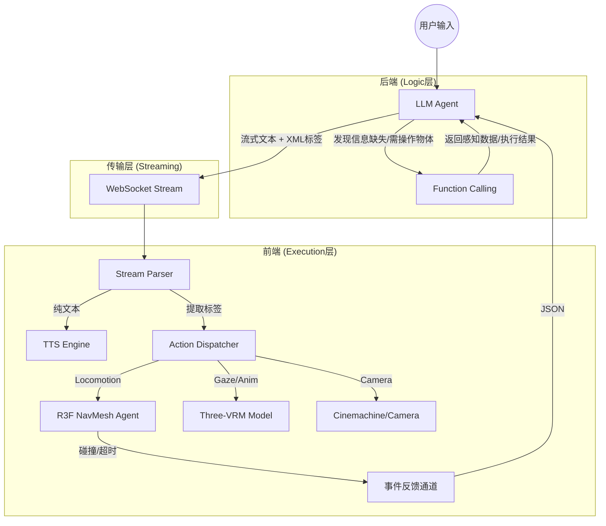

# 虚拟角色驱动系统 (VCDS) 详细设计文档 V2.1 (混合驱动版)

## 1. 系统架构与数据流图

V2.1 采用 **“逻辑归工具，表演归标签”** 的混合驱动模式。通过 WebSocket 实现流式文本（含 XML 标签）与结构化工具回调的并行传输。

### 1.1 数据流图 (Data Flow)



---

## 2. 指令集定义 (XML Performance Tags)

XML 标签用于控制**即时表现**。前端解析器在读取到完整标签的瞬间触发执行，实现音画同步。

### 2.1 移动通道 (Locomotion)
- `<move target="id" distance="1.0" gait="walk|run" />`：语义目标移动。
- `<move_dir dir="forward|backward|left|right" dist="2.0" />`：相对方向微调（带寻路射线检测）。
- `<turn target="id" angle="90" />`：转向特定目标或绝对角度。

### 2.2 视线与表现 (Gaze & Animation)
- `<gaze target="id" />`：视线聚焦（`target="user"` 或 `target="reset"` 回正）。
- `<anim id="clip_name" loop="true|false" />`：触发骨骼动画（如 `wave`, `nod`, `sit`, `think`）。
- `<emote id="emotion_id" intensity="1.0" />`：触发 VRM 表情混合（如 `joy`, `angry`, `sorrow`）。

### 2.3 导播摄像机 (Camera Director)
- `<cam mode="ots|fpv|front" dist="close|mid|far" />`：切换机位与景别。

### 2.4 流程控制 (Flow Control)
- `<wait sec="2.5" />`：暂停文本解析与 TTS 播放，维持当前动作状态。

---

## 3. 工具集定义 (Backend Tool Schema)

工具用于**场景感知**与**物理交互**，通过 LangChain Tool 注入。

```python
from pydantic import BaseModel, Field
from typing import Literal

class GetGlobalSceneContext(BaseModel):
    """当周围3米内信息不足时，获取全场物体列表及坐标。"""
    reason: str = Field(..., description="申请全局感知的理由")

class InteractWithObject(BaseModel):
    """操作场景中的物体，如开关灯、开门。"""
    target_id: str = Field(..., description="物体ID")
    action: str = Field(..., description="操作动作，如 open, toggle, push")

class StopAllActions(BaseModel):
    """紧急停止当前所有正在进行的移动和动画。"""
    reason: str
```

---

## 4. 提示词工程 (System Prompt)

```markdown
# Role
你是一个拥有 3D 身体的智能管家。你不仅能说话，还能通过 XML 标签控制你的身体、表情和现场镜头。

# Capability & Constraints
1. **音画同步**: 你的标签应穿插在台词中。例如：`好的，我这就过去。<move target="fridge" />请稍等。`
2. **感知限制**: 你默认只能看到半径 3m 内的物体。若需寻找更远的目标，必须调用 `GetGlobalSceneContext`。
3. **相机调度**: 
   - 表达亲近或认真时，使用 `<cam mode="front" dist="close" />`。
   - 展示环境或移动时，使用 `<cam mode="ots" />`。
4. **动作建议**: 在说话开始前先用 `<anim>` 或 `<emote>` 奠定情绪基调。

# XML Syntax Example
- 移动：`<move target="table" gait="walk" />`
- 视线：`<gaze target="user_camera" />`
- 动画：`<anim id="wave" />`
- 综合：`你好！<anim id="happy" /><cam mode="front" dist="mid" />见到你很高兴。`
```

---

## 5. 前端解析与容错机制 (R3F 逻辑)

### 5.1 流式解析器 (Stream Parser)
前端维护一个 `ActionQueue`。
- **Text 处理**：逐字压入 TTS 队列。
- **Tag 处理**：
    - 正则匹配 `/<(\w+)\s+([^>]+)\/>/g`。
    - 遇到 `<wait>` 标签，暂停 TTS 消费，直到计时器结束。
    - 其他标签立即分发给对应的 R3F Controller。

### 5.2 状态机约束
为了防止动作冲突，前端对 `Locomotion` 通道执行状态锁：
- 如果旧的 `MOVE` 尚未完成（`onDestinationReached` 未触发）又收到新的 `MOVE`，前端自动执行 **Cancel-then-New** 策略，平滑过渡到新目标。

### 5.3 异常反馈回路
若 XML 指令无法执行（如：`<move target="invalid_id" />`），前端不报错，但通过 WebSocket 发送异步 JSON 告知后端：
```json
{
  "type": "error",
  "code": "TARGET_NOT_FOUND",
  "msg": "Target 'invalid_id' does not exist in the current scene."
}
```
后端收到后，会在下一轮对话中自动修正逻辑（例如：“抱歉，我没找到那个东西”）。

---

## 6. 场景注入格式 (Markdown HUD)

系统每轮对话前自动注入的上下文：

**[Scene Context]**
- **Self**: Status:`idle`, Loc:`(0, 0, 5)`, Facing:`user`
- **Current Emotion**: `neutral`
- **Nearby Objects (3m)**:
    - `cup_blue`: 蓝色杯子 | Loc:(1, 0, 4.5) | Dist:1.2m
    - `chair_wood`: 木椅子 | Loc:(-1, 0, 6) | Dist:1.5m
- **Remote Anchors**:
    - `user_camera`: 用户位置 (始终可见) | Dist: 2.0m | Ang: 0°